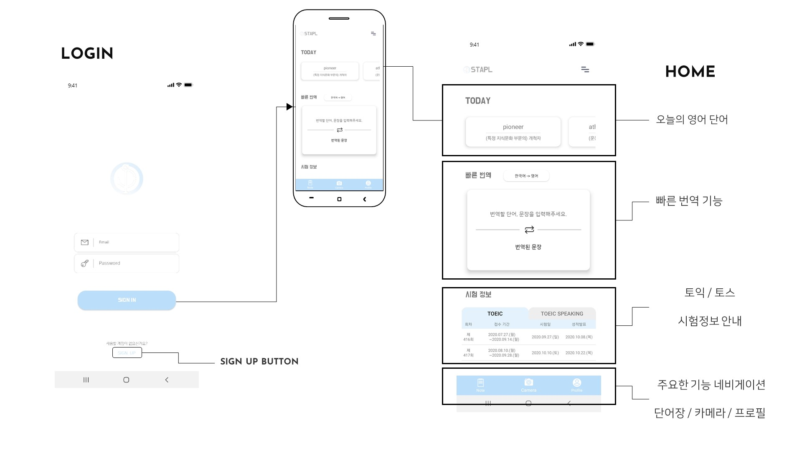

# Android Project
[CapstoneDesign2020](https://github.com/chlgkrws/Capstone_Design_2020)]
:octocat: STAPLE ( See, Take A Picture, Learn ) !
   
   
## AI를 활용한 물체인식 영어공부     - English study using A.I to use object detection   
* Capstone Design Project : 2020.05 ~ 2020.09 
* Main development tool   : Android Studio
   
## 1. Introduction   
 "Can't I study English in a fun and effective way?" We started to develop an application with this reason. The goal is active,effective studying, breaking away from the traditional hard, boring, document-based study methods. Object recognition technology using deep learning makes it easy and fast to search for words anytime, anywhere. You can study not only words but also example sentence and record your learning with the Notepad function. The Stapl app is available all age groups. You can learn simple usage and use the application efficiently. It will be applied in real life a new way of studying, not a routine study.
 
 
## 2. Presentation

